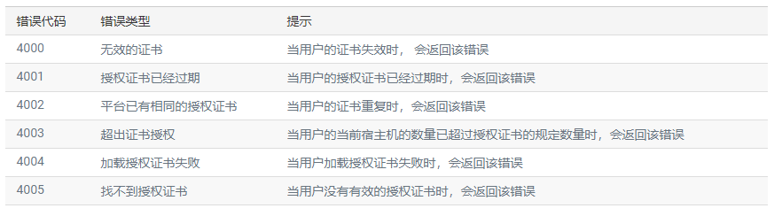
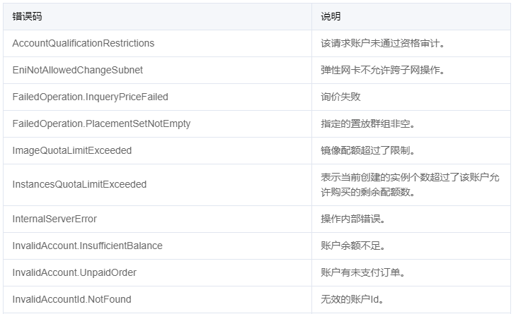

# 前后端分离开发流程与规范

## 开发流程

1. 产品经理/领导/客户提出需求
2. UI做出设计图
3. 前后端约定接口&数据&参数
4. 前后端并行开发（无强依赖，可前后端并行开发，如果需求变更，只要接口&参数不变，就不用两边都修改代码，开发效率高）
5. 前后端集成
6. 前端页面调整
7. 集成成功
8. 交付

## 注意事项

1. 在开需求会议的时候，前后端工程师必须全部参加，并且需要制定好接口文档，后端工程师要写好测试用例。
2. 后端工程师完成接口测试，使用Postman或者其他浏览器插件。
3. 加重了前端团队的工作量，减轻了后端团队的工作量，提高了性能和可扩展性。
4. 如果页面上有一些权限等等相关的校验，那么这些相关的数据也可以从接口里拿。
5. 数据校验，前后端都需要做。
6. 前端需要有机制应对后端请求超时以及后端服务宕机的情况，友好的展示给用户。


# RESTful API 设计规范

> 本文档只讨论API设计规范，具体的参数定义与返回体格式，由内部编码规范进行约束。

## Table of Contents

  * [RESTful API 设计规范](#restful-api-设计规范)
  * [关于「能愿动词」的使用](#关于能愿动词的使用)
  * [Protocol](#protocol)
  * [API Root URL](#api-root-url)
  * [Versioning](#versioning)
    * [在 URL 中嵌入版本编号](#在-url-中嵌入版本编号)
    * [通过媒体类型来指定版本信息](#通过媒体类型来指定版本信息)
  * [Endpoints](#endpoints)
  * [HTTP 动词](#http-动词)
  * [Filtering](#filtering)
  * [Authentication](#authentication)
  * [Response](#response)
    * [200 ok](#200-ok)
* [错误消息](#错误消息)
  * [错误码规则](#错误码规则)
  * [建议参考](#建议参考)

## 关于「能愿动词」的使用

为了避免歧义，文档大量使用了「能愿动词」，对应的解释如下：

* `必须 (MUST)`：绝对，严格遵循，请照做，无条件遵守；
* `一定不可 (MUST NOT)`：禁令，严令禁止；
* `应该 (SHOULD)` ：强烈建议这样做，但是不强求；
* `不该 (SHOULD NOT)`：强烈不建议这样做，但是不强求；
* `可以 (MAY)` 和 `可选 (OPTIONAL)` ：选择性高一点，在这个文档内，此词语使用较少；

> 参见：[RFC 2119](http://www.ietf.org/rfc/rfc2119.txt)

## Protocol

客户端在通过 `API` 与后端服务通信的过程中，`应该` 使用 `HTTPS` 协议。

## API Root URL

`API` 的根入口点应尽可能保持足够简单，这里有两个常见的 `URL` 根例子：

* api.example.com/*
* example.com/api/*
* iauth/*
* ibase/*

> 如果你的应用很庞大或者你预计它将会变的很庞大，那 `应该` 将 `API` 放到子域下（`api.example.com`）。这种做法可以保持某些规模化上的灵活性。

## Versioning

所有的 `API` 必须保持向后兼容，你 `必须` 在引入新版本 `API` 的同时确保旧版本 `API` 仍然可用。所以 `应该` 为其提供版本支持。

目前比较常见的两种版本号形式：

### 在 URL 中嵌入版本编号

```bash
api.example.com/v1/*
```

这种做法是版本号直观、易于调试；另一种做法是，将版本号放在 `HTTP Header` 头中：

### 通过媒体类型来指定版本信息

```bash
Accept: application/vnd.example.com.v1+json
```

其中 `vnd` 表示 `Standards Tree` 标准树类型，有三个不同的树: `x`，`prs` 和 `vnd`。你使用的标准树需要取决于你开发的项目

* 未注册的树（`x`）主要表示本地和私有环境
* 私有树（`prs`）主要表示没有商业发布的项目
* 供应商树（`vnd`）主要表示公开发布的项目

> 后面几个参数依次为应用名称（一般为应用域名）、版本号、期望的返回格式。

至于具体把版本号放在什么地方，这个问题一直存在很大的争议，结合我们目前已有的技术方案，`应该`使用`第一种`方式定义版本号。

## Endpoints

端点就是指向特定资源或资源集合的 `URL`。在端点的设计中，你 `必须` 遵守下列约定：

* URL 的命名 `必须` 全部小写
* URL 中资源（`resource`）的命名 `必须` 是名词，并且 `必须` 是复数形式
* `必须` 优先使用 `Restful` 类型的 URL
* URL `必须` 是易读的
* URL `一定不可` 暴露服务器架构

> 至于 URL 是否必须使用连字符（`-`） 或下划线（`_`），不做硬性规定，但 `必须` 根据团队情况统一一种风格。

来看一个反例

* https://api.example.com/getUserInfo?userid=1
* https://api.example.com/getusers
* https://api.example.com/sv/u
* https://api.example.com/cgi-bin/users/get_user.php?userid=1

再来看一个正列

* https://api.example.com/zoos
* https://api.example.com/animals
* https://api.example.com/zoos/{zoo}/animals
* https://api.example.com/animal_types
* https://api.example.com/employees

## HTTP 动词

对于资源的具体操作类型，由 `HTTP` 动词表示。常用的 `HTTP` 动词有下面五个（括号里是对应的 `SQL` 命令）。

* GET（SELECT）：从服务器取出资源（一项或多项）。
* POST（CREATE）：在服务器新建一个资源。
* PUT（UPDATE）：在服务器更新资源（客户端提供改变后的完整资源）。
* PATCH（UPDATE）：在服务器更新资源（客户端提供改变的属性）。
* DELETE（DELETE）：从服务器删除资源。

其中

1 删除资源 `应该` 用 `DELETE` 方法，除**批量删除**的情况以外
2 创建新的资源 `必须` 使用 `POST` 方法
3 更新资源 `应该` 使用 `PUT` 方法
4 获取资源信息 `必须` 使用 `GET` 方法

针对每一个端点来说，下面列出所有可行的 `HTTP` 动词和端点的组合

| 请求方法 | URL                              | 描述                                             |
| -------- | -------------------------------- | ------------------------------------------------ |
| GET      | /zoos                            | 列出所有的动物园(ID和名称，不要太详细)           |
| POST     | /zoos                            | 新增一个新的动物园                               |
| GET      | /zoos/{zoo}                      | 获取指定动物园详情                               |
| PUT      | /zoos/{zoo}                      | 更新指定动物园(整个对象)                         |
| PATCH    | /zoos/{zoo}                      | 更新动物园(部分对象)                             |
| DELETE   | /zoos/{zoo}                      | 删除指定动物园                                   |
| GET      | /zoos/{zoo}/animals              | 检索指定动物园下的动物列表(ID和名称，不要太详细) |
| GET      | /animals                         | 列出所有动物(ID和名称)。                         |
| POST     | /animals                         | 新增新的动物                                     |
| GET      | /animals/{animal}                | 获取指定的动物详情                               |
| PUT      | /animals/{animal}                | 更新指定的动物(整个对象)                         |
| PATCH    | /animals/{animal}                | 更新指定的动物(部分对象)                         |
| GET      | /animal_types                    | 获取所有动物类型(ID和名称，不要太详细)           |
| GET      | /animal_types/{type}             | 获取指定的动物类型详情                           |
| GET      | /employees                       | 检索整个雇员列表                                 |
| GET      | /employees/{employee}            | 检索指定特定的员工                               |
| GET      | /zoos/{zoo}/employees            | 检索在这个动物园工作的雇员的名单(身份证和姓名)   |
| POST     | /employees                       | 新增指定新员工                                   |
| POST     | /zoos/{zoo}/employees            | 在特定的动物园雇佣一名员工                       |
| DELETE   | /zoos/{zoo}/employees/{employee} | 从某个动物园解雇一名员工                         |

> 超出 `Restful` 端点的，`应该` 模仿上表的方式来定义端点。

## Filtering

> 如果记录数量很多，服务器不可能都将它们返回给用户。API `应该` 提供参数，过滤返回结果。下面是一些常见的参数。

* ?limit=10：指定返回记录的数量
* ?offset=10：指定返回记录的开始位置。
* ?page=2&pageSize=100：指定第几页，以及每页的记录数。
* ?sortby=name&order=asc：指定返回结果按照哪个属性排序，以及排序顺序。
* ?animal_type_id=1：指定筛选条件

所有 `URL` 参数 `应该` 是全小写，`应该` 使用下划线类型的参数形式。

**结合现有技术，我们采用小驼峰命名法。**

> 分页参数 `应该` 固定为 `page`、`pageSize`

经常使用的、复杂的查询 `应该` 标签化，降低维护成本。如

```bash
GET /trades?status=closed&sort=&sortby=name&order=asc

# 可为其定制快捷方式
GET /trades/recently_closed
```

## Authentication

`应该` 使用 `OAuth2.0` 的方式为 API 调用者提供登录认证。`必须` 先通过登录接口获取 `Access Token` 后再通过该 `token` 调用需要身份认证的 `API`。

Oauth 的端点设计示列

* RFC 6749   /token
* Twitter    /oauth2/token
* Fackbook   /oauth/token
* Google     /o/oauth2/token
* Github     /login/oauth/token
* Instagram  /oauth/authorize

客户端在获得 `access token` 的同时 `应该` 在响应中包含一个名为 `expiresIn` 的数据，它表示当前获得的 `token` 会在多少 `秒` 后失效。

```json
{
    "token": "token....",
    "tokenType": "Bearer",
    "expiresIn": 3600
}
```

客户端在请求需要认证的 `API` 时，`必须` 在请求头 `X-Auth-Token` 中带上 `token`。

```bash
X-Auth-Token: Bearer token...
```

当超过指定的秒数后，`access token` 就会过期，再次用过期/或无效的 `token` 访问时，服务端 `应该` 返回 `invalid_token` 的错误或 `401` 错误码。

```http
HTTP/1.1 401 Unauthorized
Content-Type: application/json
Cache-Control: no-store
Pragma: no-cache

{
    "error": "invalid_token"
}
```


## Response

所有的 `API` 响应，`必须` 遵守 `HTTP` 设计规范，`必须` 选择合适的 `HTTP` 状态码。所有接口`必须`返回状态码为`200`的`HTTP`响应， 如：

```http
HTTP/1.1 200 ok
Content-Type: application/json
Server: example.com

{
    "flag":true,
    "errorCode": 0,
    "message": "",
    "data": {
        "userName": "username"
    }
}
```

### 200 ok

`200` 状态码是最常见的 `HTTP` 状态码，在所有 **成功** 的 `HTTP` 请求中，`必须` 返回此状态码。`HTTP` 响应实体部分 `必须` 直接就是数据，不要做多余的包装。

错误示例：

```http
HTTP/1.1 200 ok
Content-Type: application/json
Server: example.com

{
    "user": {
        "id":1,
        "nickname":"fwest",
        "username": "example"
    }
}
```

正确示例：

1、获取单个资源详情

```json
{
    "flag":true,
    "errorCode":"",
    "message":"",
    "data":{
        "id": 1,
        "username": "godruoyi",
        "age": 88,
    }
}
```

2、获取资源集合

```json
{
    "flag":true,
    "errorCode":"",
    "message":"",
    "data":[
        {
            "id": 1,
            "username": "godruoyi",
            "age": 88,
        },
        {
            "id": 2,
            "username": "foo",
            "age": 88,
        }
    ]
}
```

3、额外的媒体信息

```json
{
    "flag":true,
    "errorCode":"",
    "message":"",
    "data": [
        {
            "id": 1,
            "avatar": "https://lorempixel.com/640/480/?32556",
            "nickname": "fwest",
            "last_logined_time": "2018-05-29 04:56:43",
            "has_registed": true
        },
        {
            "id": 2,
            "avatar": "https://lorempixel.com/640/480/?86144",
            "nickname": "zschowalter",
            "last_logined_time": "2018-06-16 15:18:34",
            "has_registed": true
        }
    ],
    "meta": {
        "pagination": {
            "total": 101,
            "count": 2,
            "pageLimit": 2,
            "current_page": 1,
            "total_pages": 51,
            "links": {
                "next": "http://api.example.com?page=2"
            }
        }
    }
}
```

> 其中，分页和其他额外的媒体信息，`应该`放到 `meta` 字段中。

其他 `HTTP` 状态码请参考 [HTTP 状态码- 维基百科](https://zh.wikipedia.org/zh-hans/HTTP%E7%8A%B6%E6%80%81%E7%A0%81)。

## 错误消息

当请求发生错误或者失败时，`Response` 中`flag` 必须为`false`，`errorCode`与`message` `必须`同时存在。

### 错误码规则

错误码定义规则一般有两种方式，一种是以固定位数的数字作为`errorCode`，一种是以英文简写作为`errorCode`。

1、固定位数的数字定义错误码（示例：青云）



2、英文简写定义错误码（示例：腾讯云）



3、错误消息响应格式

```json
{
  "flag":false,
  "errorCode":4000,
  "message":"无效的证书",
  "data":{}
}
```


## 测试工具

[PostMan](https://learning.postman.com/docs/getting-started/introduction/****)


## 建议参考

[restful-api-design-references](https://github.com/aisuhua/restful-api-design-references)

[Principles of good RESTful API Design（译）](http://www.cnblogs.com/moonz-wu/p/4211626.html)

[OAuth 2.0](https://oauth.net/2/)

[理解 RESTful 架构](http://www.ruanyifeng.com/blog/2011/09/restful.html)

[RESTful API 设计指南](http://www.ruanyifeng.com/blog/2014/05/restful_api.html)

[HTTP 状态码- 维基百科](https://zh.wikipedia.org/zh-hans/HTTP%E7%8A%B6%E6%80%81%E7%A0%81)

[青云错误码](https://docs.qingcloud.com/product/api/common/error_code.html)

[腾讯云错误码](https://cloud.tencent.com/document/api/213/30435)
